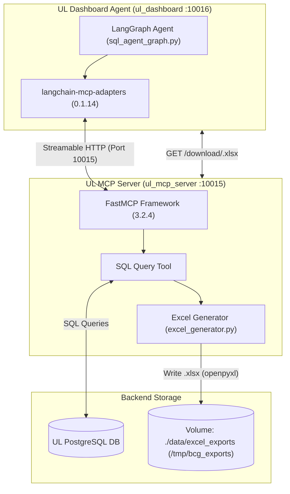

# UL (Unilever) MCP Server & Excel Generation Stack

Here is the complete breakdown of the **UL (Unilever)** Model Context Protocol stack and Excel generation tools used in this repository.

---

## 1. UL MCP & Excel Dependency Matrix

| Package Name | Version Bound | Role in UL MCP Architecture | Primary Reference File |
| :--- | :--- | :--- | :--- |
| **`mcp`** | `>=1.12, <1.27` | Core Python MCP SDK handling protocol schemas, transports (`streamable-http`), and session streams. | [`mcp_servers/ul_mcp_server/requirements.txt`](file:///c:/Users/SravanKumarJalapati/Downloads/unilever_ama_insights_agent-wipro-poc-prod_v1/unilever_ama_insights_agent-wipro-poc-prod/mcp_servers/ul_mcp_server/requirements.txt) |
| **`fastmcp`** | `==3.2.4` | High-level framework used to declare UL query & KPI functions as MCP tools via `@mcp.tool()`. | [`mcp_servers/ul_mcp_server/requirements.txt`](file:///c:/Users/SravanKumarJalapati/Downloads/unilever_ama_insights_agent-wipro-poc-prod_v1/unilever_ama_insights_agent-wipro-poc-prod/mcp_servers/ul_mcp_server/requirements.txt) |
| **`langchain-mcp-adapters`** | `==0.1.14` | Bridge adapter used by `ul_dashboard` (`MultiServerMCPClient`) to load tools dynamically from `ul_mcp_server`. | [`orchestrator_mcp_dashboard/requirements.txt`](file:///c:/Users/SravanKumarJalapati/Downloads/unilever_ama_insights_agent-wipro-poc-prod_v1/unilever_ama_insights_agent-wipro-poc-prod/orchestrator_mcp_dashboard/requirements.txt) |
| **`openpyxl`** | `latest` | Core engine used by [`excel_generator.py`](file:///c:/Users/SravanKumarJalapati/Downloads/unilever_ama_insights_agent-wipro-poc-prod_v1/unilever_ama_insights_agent-wipro-poc-prod/core/tools/excel_generator.py) to build multi-sheet BCG-styled `.xlsx` reports. | [`core/tools/excel_generator.py`](file:///c:/Users/SravanKumarJalapati/Downloads/unilever_ama_insights_agent-wipro-poc-prod_v1/unilever_ama_insights_agent-wipro-poc-prod/core/tools/excel_generator.py) |
| **`pyexcel` / `pyexcel-xlsx`** | `>=0.7.0` / `>=0.6.0` | Helper libraries for tabular data extraction and Excel format conversions. | [`requirements-local.txt`](file:///c:/Users/SravanKumarJalapati/Downloads/unilever_ama_insights_agent-wipro-poc-prod_v1/unilever_ama_insights_agent-wipro-poc-prod/requirements-local.txt) |
| **`pandas`** | `>=2.2.3` | Tabular data manipulation engine used for rendering query result sets before writing Excel workbooks. | [`requirements-local.txt`](file:///c:/Users/SravanKumarJalapati/Downloads/unilever_ama_insights_agent-wipro-poc-prod_v1/unilever_ama_insights_agent-wipro-poc-prod/requirements-local.txt) |

---

## 2. Where Excel Generation is Located

### 1. Code Implementation
- **Generator Script**: [`core/tools/excel_generator.py`](file:///c:/Users/SravanKumarJalapati/Downloads/unilever_ama_insights_agent-wipro-poc-prod_v1/unilever_ama_insights_agent-wipro-poc-prod/core/tools/excel_generator.py)
  - Function: `generate_excel(records, question, sql, base_url)`
  - Creates a multi-sheet `.xlsx` workbook containing:
    - **Data Sheet**: Query results with BCG Green headers (`#00A651`), alternating fills, and cell borders.
    - **Summary Sheet**: Query execution stats, record counts, and column metadata.
- **Workflow Node**: Integrated into the LangGraph state machine in [`core/workflows/sql_agent_graph.py`](file:///c:/Users/SravanKumarJalapati/Downloads/unilever_ama_insights_agent-wipro-poc-prod_v1/unilever_ama_insights_agent-wipro-poc-prod/core/workflows/sql_agent_graph.py) as `generate_excel_node`.

### 2. File Storage & Volume Mount
- Output Directory: `/tmp/bcg_exports/<uuid>.xlsx`
- Shared Volume Mount in [`docker-compose-ul.yml`](file:///c:/Users/SravanKumarJalapati/Downloads/unilever_ama_insights_agent-wipro-poc-prod_v1/unilever_ama_insights_agent-wipro-poc-prod/docker-compose-ul.yml):
  ```yaml
  volumes:
    - ./data/excel_exports:/tmp/bcg_exports
  ```

### 3. HTTP Download Route
- The `ul_mcp_server` container (Port **10015**) exposes an endpoint for downloading generated Excel reports:
  ```http
  GET http://localhost:10015/download/{filename}.xlsx
  ```

---

## 3. Architecture & Data Flow


